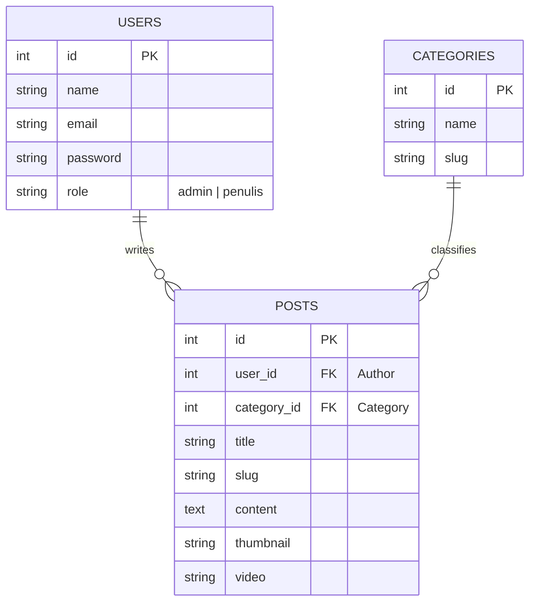
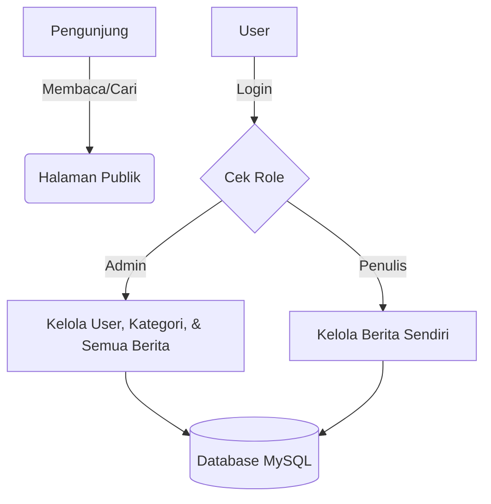

# EEPIS News — Portal Berita Kampus PENS

EEPIS News adalah platform portal berita digital yang dirancang khusus untuk manajemen konten berita di lingkungan Politeknik Elektronika Negeri Surabaya (PENS). Proyek ini dibangun sebagai bagian dari penilaian 100 kerja divisi WM ENT GEN 20

---

## Fitur Utama

### 1. Sistem Autentikasi & Otorisasi
- **Multi-role Access**: Mendukung peran **Admin** dan **Penulis**.
- **Secure Auth**: Login, Register, dan Logout dengan proteksi middleware Laravel.

### 2. Manajemen Konten (CMS)
- **Rich Text Editor**: Integrasi CKEditor 5 Super Build (Gambar inline, embed video, tabel, format teks kompleks).
- **Media Management**: Fitur upload thumbnail berita dan sistem upload gambar terintegrasi.
- **Ownership Control**: Penulis hanya dapat mengelola berita miliknya sendiri, sementara Admin memiliki kontrol penuh.

### 3. Manajemen Kategori
- CRUD kategori dinamis yang terhubung langsung dengan sistem berita.

### 4. Halaman Publik (Premium UI/UX)
- **Clean Typography**: Desain berfokus pada keterbacaan artikel (premium news feel).
- **Dinamis**: Homepage dengan *featured article*, pencarian cerdas, dan filter kategori.
- **Responsive**: Layout yang menyesuaikan dengan perangkat mobile dan desktop.

### 5. Dashboard
- Statistik ringkasan data berita dan kategori yang menyesuaikan dengan hak akses pengguna.

---

## Tech Stack

- **Backend**: Laravel 13
- **Frontend**: Blade Engine, Tailwind CSS, Alpine.js
- **Database**: MySQL
- **Rich Editor**: CKEditor 5 Super Build

---

## Desain Sistem

### 1. ERD (Entity Relationship Diagram)


### 2. User Flow (DFD Level 1)


---

## Struktur Proyek

Berikut adalah struktur folder utama yang telah diorganisir berdasarkan fungsionalitasnya:

```text
eepis-news/
├── app/
│   ├── Http/Controllers/
│   │   ├── Auth/              # Logika Autentikasi
│   │   ├── NewsController.php # Controller Halaman Publik
│   │   ├── PostController.php # CRUD Berita (CMS)
│   │   └── ...                # Category & User Controller
│   └── Models/                # User, Post, Category Models
├── database/
│   ├── migrations/            # Skema Database
│   └── seeders/               # Data Dummy (DummyNewsSeeder)
├── resources/
│   ├── css/                   # Tailwind Custom Styles
│   ├── js/                    # CKEditor & Alpine Setup
│   └── views/
│       ├── components/        # UI Components (Sidebar, Topbar)
│       ├── dashboard/         # Views Admin Panel (Cleaned)
│       ├── layouts/           # Layout news, dashboard, guest
│       └── news/              # Views Halaman Publik
└── routes/
    ├── web.php                # Route Utama & CMS
    └── auth.php               # Route Autentikasi
```

---

## Arsitektur Proyek
- **Separation of Concerns**: Logika Controller dipisahkan berdasarkan fungsinya (Public, Admin, Auth).
- **Security**: Implementasi middleware `auth` dan proteksi level aplikasi untuk data kepemilikan.
- **Clean Code**: Penggunaan naming convention yang konsisten dan struktur folder standar Laravel.

---

## Instalasi

1. **Clone & Install**
   ```bash
   git clone https://github.com/username/eepis-news.git
   composer install && npm install
   ```

2. **Environment**
   ```bash
   cp .env.example .env
   php artisan key:generate
   ```

3. **Database & Seeder**
   ```bash
   php artisan migrate --seed
   php artisan db:seed --class=DummyNewsSeeder
   ```

4. **Storage Link**
   ```bash
   php artisan storage:link
   ```

5. **Run**
   ```bash
   php artisan serve
   ```

